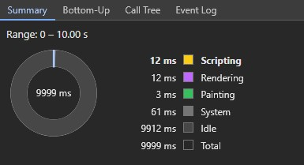
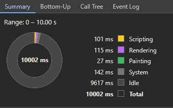
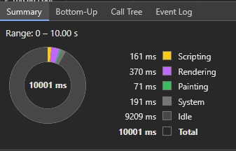

# Animation Performance Test

This project compares the performance of animations created using CSS, unoptimized JavaScript, and optimized JavaScript. The animations are designed to make a circle element pulse (expand and contract) in size. We measure the performance impact of each approach using Chrome DevTools' Performance panel.

## Cloning and Running the Project

To clone the project and run it locally, follow these steps:@

**1. Clone the repository:**

```
git clone https://github.com/tomasdevs/animation-performance-test.git
cd animation-performance-test
```

**2. Open the desired folder:**

- For CSS animation: cd css-animation
- For optimized JS animation: cd js-animation-optimized
- For unoptimized JS animation: cd js-animation-unoptimized

**3. Run the HTML file:**

- Open the index.html file in your browser.

**4. Measure Performance:**

- Open Chrome DevTools (F12) and go to the "Performance" tab. Start profiling to measure the performance of each animation.

## Performance Results

Here are the performance results of each animation approach, based on a 10-second run in Chrome DevTools.

### CSS Animation



_Source: Created by TomasDevs (2024)_

- **Total Blocking Time:** 390 ms

**Notes:**

- CSS animations tend to perform better because they are offloaded to the browser's native rendering engine, especially when only working with _transform_ or _opacity_. In this case, the animation is very efficient with low impact on scripting and rendering time.

### Optimized JavaScript Animation



_Source: Created by TomasDevs (2024)_

- **Total Blocking Time:** 400 ms

**Notes:**

- The optimized JS version uses _requestAnimationFrame_ and a smooth sine wave function to manage the animation. It performs better than the unoptimized version but still requires more scripting time than the CSS version, as each frame of the animation is calculated in JavaScript. The rendering and painting costs are slightly higher than CSS but are still reasonably efficient.

### Unoptimized JavaScript Animation



_Source: Created by TomasDevs (2024)_

- **Total Blocking Time:** 440 ms

**Notes:**

- The unoptimized JS version uses a simple loop without consideration of time-based progression. This results in much higher scripting, rendering, and painting times because the animation is not handled efficiently. The lack of time-based progression also leads to more frequent repaints and reflows.

## Analysis

**CSS Animation** performs the best overall because it's hardware-accelerated by the browser, minimizing the amount of JavaScript processing and reducing the burden on the main thread. It maintains a low _Total Blocking Time_ and keeps the rendering and painting times minimal.

**Optimized JavaScript Animation** is a close second. While it requires more scripting time due to the use of JavaScript to calculate each frame, the use of _requestAnimationFrame_ helps ensure that it remains smooth and synchronized with the browser's rendering cycle.

**Unoptimized JavaScript Animation** performs the worst. The constant recalculation of the animation without any consideration for frame timing leads to much higher scripting, rendering, and painting times, significantly impacting the page's performance.

## Conclusion

For simple animations that can be handled entirely by the browser (like scaling or fading), **CSS animations** are the most performant and should be the default choice.

For more complex animations requiring dynamic control, JavaScript animations can be used but should be carefully optimized using techniques like _requestAnimationFrame_ to ensure smooth and efficient performance.
